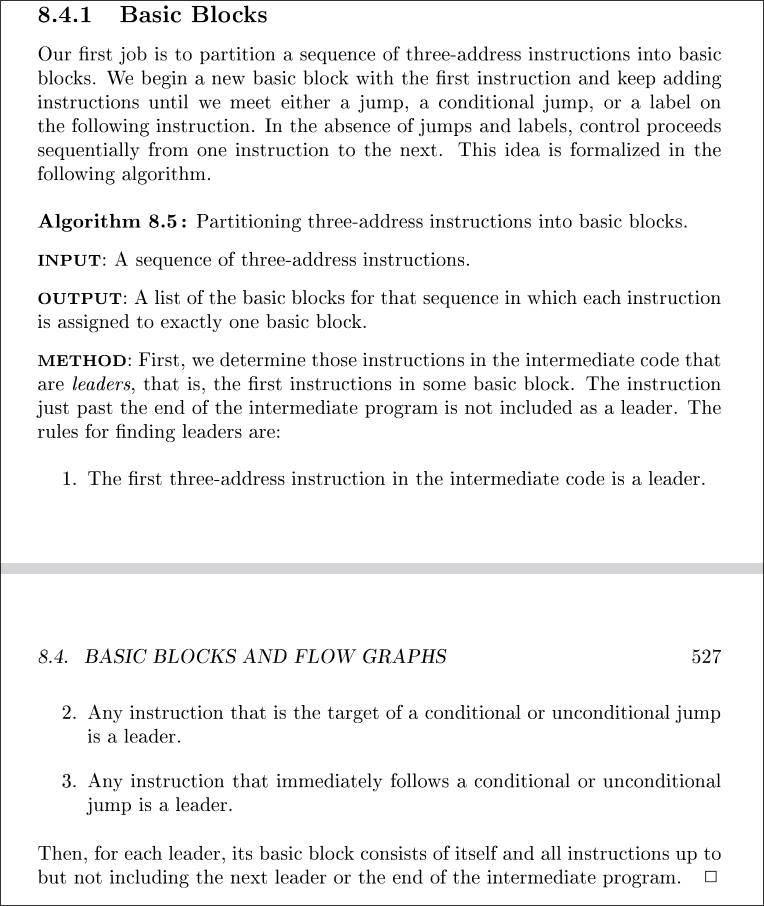
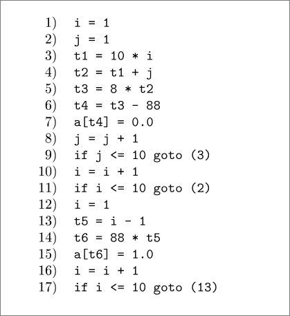
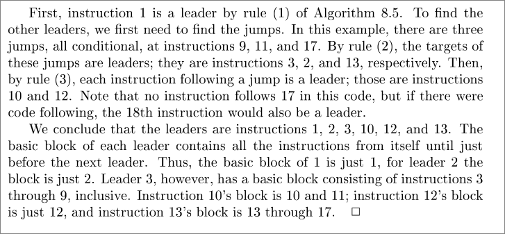

# Basic blocks
It is important to partition the three adress code into basic blocks, this is useful for register allocation and controll flow graphs

## Algorithm 
basic blocks are constructed using the following algorithm:

Example:

Explanatoin:

